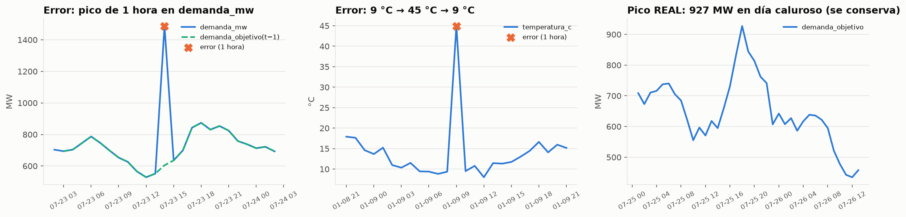
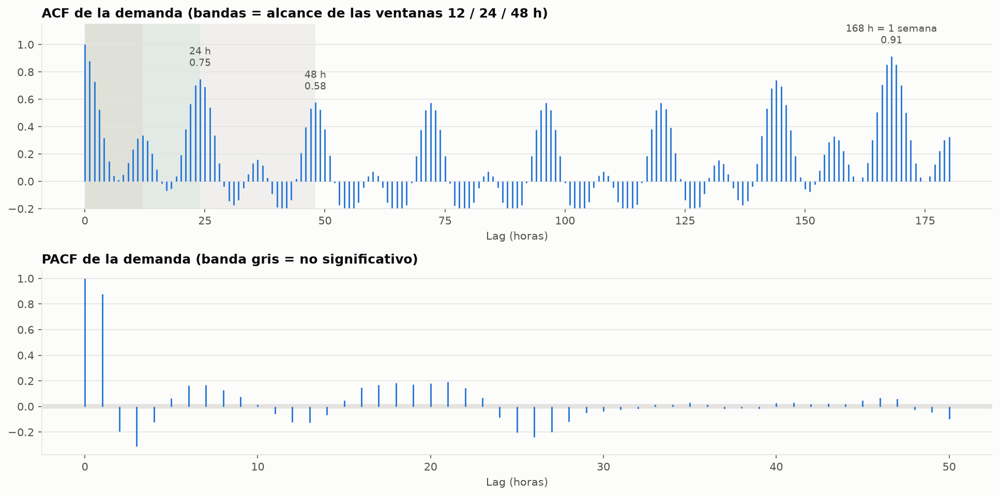
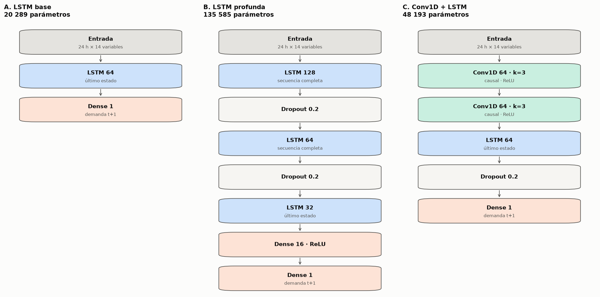
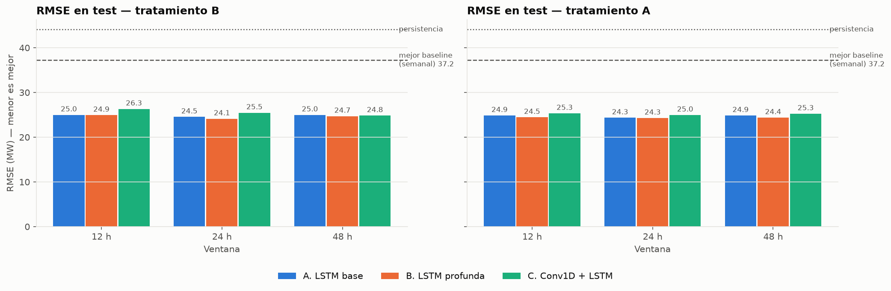
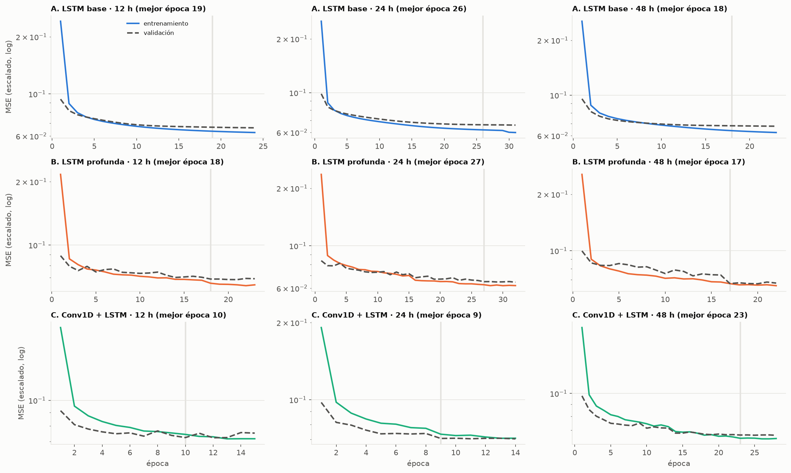
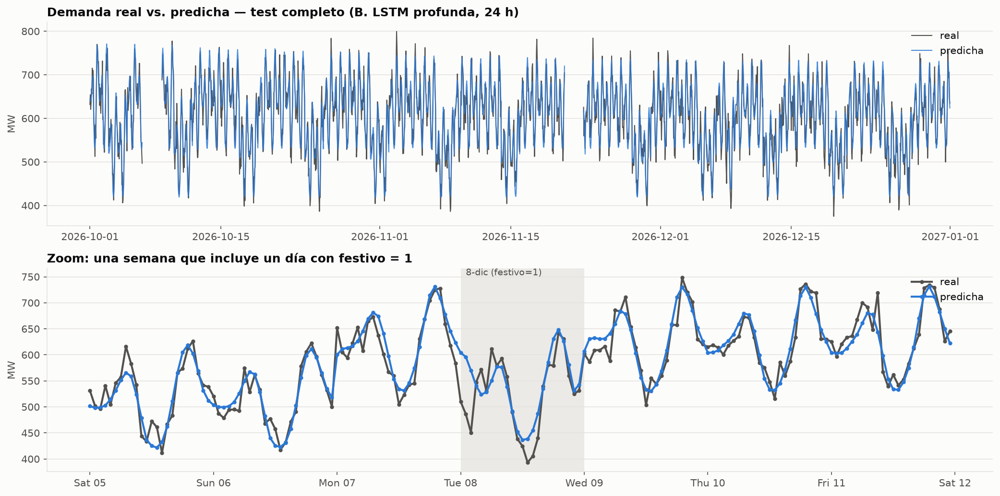
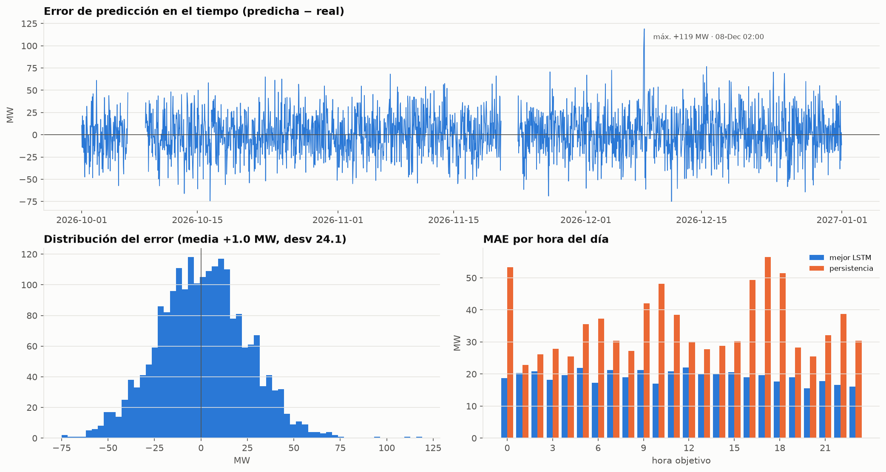

# Taller LSTM: predicción de demanda eléctrica de la hora siguiente

**App desplegada:** https://tallerlstm-yvmkqcgmmz6v62dwmssx6u.streamlit.app/

Diseño, implementación, comparación y justificación de arquitecturas LSTM para predecir la **demanda eléctrica de la hora siguiente** a partir de una ventana de *n* horas consecutivas (12, 24 y 48 h) de información histórica multivariada.

**Contenido**
1. [Problema y variables](#1-problema-y-variables)
2. [Limpieza de datos](#2-limpieza-de-datos)
3. [Análisis exploratorio](#3-análisis-exploratorio)
4. [Preparación de las secuencias](#4-preparación-de-las-secuencias)
5. [Diseño de arquitecturas](#5-diseño-de-arquitecturas)
6. [Resultados](#6-resultados)
7. [Gráficas](#7-gráficas)
8. [Preguntas de análisis](#8-preguntas-de-análisis)
9. [Despliegue: app web](#9-despliegue-app-web)
10. [Estructura y cómo reproducir](#10-estructura-y-cómo-reproducir)

---

## 1. Problema y variables

**Dataset:** `dataset_demanda_energia_LSTM_2025_2026.csv`. Datos horarios del 2025-01-01 al 2026-12-31.

| Rol | Variables | Justificación |
|---|---|---|
| **Variable dependiente (y)** | `demanda_objetivo` | Se verificó que `demanda_objetivo(t) = demanda_mw(t+1)` en el 99.8 % de las filas: es exactamente la demanda de la hora siguiente |
| **Independientes: autorregresiva** | `demanda_mw` de las *n* horas previas | Es el mejor predictor individual (autocorrelación lag 1 = 0.88) |
| **Independientes: exógenas** | `temperatura_c`, `humedad_pct`, `radiacion_wm2`, `precio_kwh` | Mostraron relación con la demanda en el EDA |
| **Independientes: calendario** | `hora`, `dia_semana`, `mes` (seno/coseno), `fin_semana`, `festivo` | Ciclos diario, semanal y anual |
| **Excluidas** | `viento_kmh`, `precipitacion_mm`, `periodo_dia`, `timestamp` | Sin información (viento, lluvia), redundante con `hora` (periodo), reemplazado por sus componentes (timestamp) |

`demanda_objetivo` **nunca** se usa como entrada: es la respuesta, y usarla sería fuga de información.

## 2. Limpieza de datos

**Principio:** un valor *atípico* (raro) no es lo mismo que un valor *anómalo* (imposible). Solo se anulan los anómalos y **nunca se reemplazan por valores inventados**. Los picos reales de demanda (hasta 927 MW, en días calurosos) se conservan.

| Problema encontrado | Regla aplicada |
|---|---|
| Filas desordenadas | Orden cronológico; se verificó la rejilla horaria completa (17 520 horas, sin huecos) |
| 30 filas duplicadas | Eliminadas |
| `periodo_dia` con formato inconsistente y 60 etiquetas que no correspondían a su hora | Se recalcula desde `hora` (es una etiqueta derivada) |
| Valores imposibles o picos aislados de 1 hora (temperatura, humedad, viento, precio) | Se anulan (NaN) tras un protocolo de 4 pruebas: física, contexto temporal, consistencia interna y coherencia causal |
| 40 conflictos entre `demanda_mw(t)` y `demanda_objetivo(t−1)` (dos mediciones de la misma hora) | Se comparan dos tratamientos: **A** descarta esas ventanas; **B** recupera el valor desde la otra medición real |
| Faltantes en las exógenas | *Forward-fill* causal de máximo 3 h (último valor conocido, sin usar el futuro) + bandera de relleno |

Cada valor marcado, con su contexto y la prueba que falló, queda en [`resultados/auditoria_limpieza.csv`](resultados/auditoria_limpieza.csv). Detalle en [`notebooks/01_limpieza.ipynb`](notebooks/01_limpieza.ipynb).



**Sensibilidad:** se re-entrenó conservando los 15 picos de precio en vez de anularlos. En la LSTM base el RMSE de test no cambia (24.54 MW en ambos casos); en la LSTM profunda empeora levemente, de 24.13 a 24.31 MW. La decisión no cambia las conclusiones.

## 3. Análisis exploratorio

Hallazgos principales ([`notebooks/02_eda.ipynb`](notebooks/02_eda.ipynb)):
- **Dos picos diarios** (6–7 h y 19 h), con un valle al mediodía. Los fines de semana la demanda baja ~16 %.
- **Estacionalidad anual:** el máximo es en junio–julio y el mínimo en diciembre–enero. No hay tendencia entre años.
- **Autocorrelación:** lag 1 = 0.88, lag 24 = 0.75 y lag 168 (una semana) = 0.92. Las ventanas de 24 h ven la misma hora del día anterior; ninguna ventana del taller alcanza la semana anterior, por eso el calendario es imprescindible.
- **La temperatura** es la variable climática más robusta (relación en forma de "J").
- **La correlación global engaña:** radiación, humedad y precio cambian de signo al compararse dentro de la misma hora del día.
- **El test (oct–dic) tiene menor variabilidad** que train, así que el mismo error en MW produce un R² más bajo.



## 4. Preparación de las secuencias

- **División cronológica** por la hora del objetivo: train hasta 2026-06-30 (75 %), validación de julio a septiembre de 2026 (12.5 %) y test de octubre a diciembre de 2026 (12.5 %). No se usa `train_test_split` aleatorio.
- **Normalización** (`StandardScaler`) ajustada **solo con train**. Las métricas se reportan en MW.
- **Ventanas:** tensores `(muestras, n, 14)`. Solo se crean ventanas con *n* horas consecutivas válidas.
- **Pruebas automáticas de fuga** (notebook 03): los splits no se solapan, la entrada termina en *t* y el objetivo es *t+1*, y los escaladores solo vieron train.
- **Comparación justa:** todas las métricas de test se calculan sobre el mismo conjunto de 2 110 horas.

## 5. Diseño de arquitecturas



| | Arquitectura | Parámetros | Justificación |
|---|---|---|---|
| **A. LSTM base** | `LSTM(64) → Dense(1)` | 20 289 | Modelo mínimo viable y referencia. Una capa recurrente basta para resumir la ventana. |
| **B. LSTM profunda** | `LSTM(128) → Dropout → LSTM(64) → Dropout → LSTM(32) → Dense(16) → Dense(1)` | 135 585 | Representaciones jerárquicas (hora → forma del día). `return_sequences=True` pasa la secuencia completa entre capas. Dropout 0.2 contra el sobreajuste. |
| **C. Conv1D + LSTM** (propuesta) | `Conv1D(64, k=3) → Conv1D(64, k=3) → LSTM(64) → Dropout → Dense(1)` | 48 193 | Las convoluciones *causales* detectan patrones locales de pocas horas (rampas de subida y bajada, donde más fallan los métodos simples); la LSTM modela su evolución. |

**Entrenamiento:** pérdida MSE, Adam (lr = 0.001), lotes de 128, máximo 100 épocas. Early Stopping con paciencia 5 y mejora mínima ≈ 0.1 MW, restaurando los mejores pesos. ReduceLROnPlateau.

Justificación detallada en la sección 0 de [`notebooks/04_resultados.ipynb`](notebooks/04_resultados.ipynb).

## 6. Resultados

Métricas de **test** (oct–dic 2026, datos nunca vistos), en MW. *Épocas* = época cuyos pesos se restauraron. Tratamiento A/B = manejo de los 40 conflictos de demanda (sección 2).

| Modelo | Ventana | Tratamiento | MAE | MSE | RMSE | MAPE (%) | R² | Épocas |
|---|---|---|---|---|---|---|---|---|
| A. LSTM base | 12 h | B | 19.91 | 625.0 | 25.00 | 3.41 | 0.900 | 19 |
| A. LSTM base | 24 h | B | 19.47 | 602.4 | 24.54 | 3.33 | 0.903 | 26 |
| A. LSTM base | 48 h | B | 19.91 | 625.0 | 25.00 | 3.40 | 0.900 | 18 |
| B. LSTM profunda | 12 h | B | 19.88 | 622.1 | 24.94 | 3.39 | 0.900 | 18 |
| **B. LSTM profunda** | **24 h** | **B** | **19.17** | **582.1** | **24.13** | **3.28** | **0.906** | **27** |
| B. LSTM profunda | 48 h | B | 19.67 | 610.6 | 24.71 | 3.36 | 0.902 | 17 |
| C. Conv1D + LSTM | 12 h | B | 20.83 | 693.1 | 26.33 | 3.58 | 0.889 | 10 |
| C. Conv1D + LSTM | 24 h | B | 20.09 | 649.0 | 25.47 | 3.44 | 0.896 | 9 |
| C. Conv1D + LSTM | 48 h | B | 19.72 | 616.7 | 24.83 | 3.37 | 0.901 | 23 |
| A. LSTM base | 12 h | A | 19.79 | 618.2 | 24.86 | 3.37 | 0.901 | 22 |
| A. LSTM base | 24 h | A | 19.38 | 592.8 | 24.35 | 3.31 | 0.905 | 35 |
| A. LSTM base | 48 h | A | 19.79 | 618.1 | 24.86 | 3.39 | 0.901 | 18 |
| B. LSTM profunda | 12 h | A | 19.55 | 597.8 | 24.45 | 3.33 | 0.904 | 33 |
| B. LSTM profunda | 24 h | A | 19.26 | 590.1 | 24.29 | 3.30 | 0.905 | 15 |
| B. LSTM profunda | 48 h | A | 19.29 | 594.5 | 24.38 | 3.30 | 0.904 | 26 |
| C. Conv1D + LSTM | 12 h | A | 20.07 | 642.4 | 25.34 | 3.43 | 0.897 | 16 |
| C. Conv1D + LSTM | 24 h | A | 19.78 | 623.5 | 24.97 | 3.38 | 0.900 | 20 |
| C. Conv1D + LSTM | 48 h | A | 20.07 | 638.1 | 25.26 | 3.44 | 0.897 | 14 |
| *Baseline:* persistencia (hora anterior) | — | — | 35.16 | 1943.2 | 44.08 | 5.96 | 0.688 | — |
| *Baseline:* misma hora del día anterior | — | — | 51.54 | 4732.2 | 68.79 | 8.91 | 0.240 | — |
| *Baseline:* misma hora de la semana anterior | — | — | 28.38 | 1386.9 | 37.24 | 4.87 | 0.777 | — |
| *Baseline:* perfil histórico (hora × tipo de día) | — | — | 49.01 | 3627.1 | 60.23 | 8.44 | 0.417 | — |

**Conclusiones:**
- **Todas las LSTM superan con amplitud a los métodos simples:** ~35 % menos error que el mejor baseline (24–26 vs. 37.2 MW).
- **A y B quedan casi empatadas.** B con 24 h es la mejor tanto en validación como en test, y es la **desplegada**. Se eligió por el menor RMSE de **validación**; el test no se usó para decidir.
- **24 h es la mejor ventana** o empata. 48 h no aporta (salvo en C con el tratamiento B) y cuesta más.
- **El tratamiento de anomalías no cambia las conclusiones:** las diferencias entre A y B son pequeñas.
- **Una sola semilla por configuración:** diferencias menores a ~0.5 MW pueden deberse al azar de la inicialización.

Tabla completa (incluye train y validación) en [`resultados/tabla_resultados.csv`](resultados/tabla_resultados.csv).

## 7. Gráficas

**Comparación de modelos**


**Loss de entrenamiento y validación**


**Demanda real vs. predicha** (mejor modelo, test)


**Error de predicción**


## 8. Preguntas de análisis

Respuestas completas, cada una con su evidencia, en [`notebooks/05_analisis.ipynb`](notebooks/05_analisis.ipynb).

1. **¿Por qué LSTM es apropiada?**
   - La demanda tiene dependencias horarias, diarias y semanales.
   - La LSTM, con su celda de memoria y sus compuertas (olvido, entrada, salida), aprende dependencias largas sin el desvanecimiento del gradiente de una RNN simple.
   - Combina variables y relaciones no lineales.
   - Supera en ~35 % al mejor método simple.
2. **¿Qué efecto tiene la ventana?**
   - De 12 a 24 h mejora en las 3 arquitecturas: con 24 h el modelo ve la misma hora de ayer.
   - De 24 a 48 h no mejora: la autocorrelación parcial muestra que no hay información nueva después del lag ~27.
3. **¿Existe sobreajuste?**
   - No de forma relevante: la brecha entre validación y train es de 0.7–1.4 MW (3–6 %).
   - El test es igual o mejor que la validación.
   - En 60 épocas sin Early Stopping la validación no sube, aunque se aplana mientras el entrenamiento sigue bajando.
4. **Dropout**
   - Apaga al azar el 20 % de las neuronas en cada paso de entrenamiento.
   - Sin Dropout, la LSTM profunda empeora en validación (25.07 → 25.60 MW) y la brecha crece un 60 %.
5. **Early Stopping**
   - Detiene el entrenamiento cuando la validación deja de mejorar y restaura los mejores pesos.
   - Aquí su beneficio principal fue la eficiencia: entrenamientos entre 2.5 y 4 veces más rápidos, perdiendo ~0.3 MW.
   - Además, protege contra el sobreentrenamiento.
6. **¿Más neuronas = mejor?**
   - No: de 64 a 128 neuronas no mejora.
   - 256 gana 0.6 MW con 14 veces más parámetros y 10 veces más tiempo.
   - Los residuos ya son casi ruido (autocorrelación lag 1 ≈ 0.06): el modelo alcanzó el techo de predictibilidad de los datos.
7. **Modelo para producción**
   - Desplegado: LSTM profunda, 24 h (mejor en validación).
   - En un entorno con re-entrenamientos frecuentes, la LSTM base de 24 h es una alternativa razonable: 6.7 veces menos parámetros y solo 0.4 MW de diferencia.
8. **Variables más influyentes**
   - Hora del día y día de la semana dominan (importancia por permutación: +54 y +33 MW).
   - Luego radiación, festivo, demanda reciente y temperatura.
   - Precio, viento y lluvia aportan poco o nada.
9. **Limitaciones**
   - Techo de predictibilidad (~24 MW de error, casi ruido).
   - Subestima los picos.
   - Pocos días festivos para aprender su efecto: el mayor error del test (+119 MW) fue la madrugada de un festivo.
   - Horizonte de solo 1 hora.
   - Clima observado y no pronosticado.
   - Dos años de datos.
   - Una sola semilla por configuración.

## 9. Despliegue: app web

**https://tallerlstm-yvmkqcgmmz6v62dwmssx6u.streamlit.app/**

La app ([`app/app.py`](app/app.py)) carga el modelo desplegado desde [`app/modelo_demanda.joblib`](app/modelo_demanda.joblib). Ese archivo incluye la red, la normalización calculada con train, las variables y la ventana.

Una LSTM necesita las **últimas 24 horas** de variables independientes (X) para predecir la demanda de la hora siguiente (y). Por eso la app tiene tres modos:

| Modo | Qué permite |
|---|---|
| **1 · Histórico** | Elegir una fecha y hora del dataset y ver la predicción frente al valor real |
| **2 · Escenario (what-if)** | Modificar temperatura, humedad, radiación, precio y festivo, y ver cómo cambia la predicción |
| **3 · CSV propio** | Subir un CSV con al menos 24 horas consecutivas y obtener la predicción de la hora siguiente. Hay una plantilla descargable |

## 10. Estructura y cómo reproducir

```
data/raw/            dataset original (sin modificar)
data/processed/      dataset_limpio.parquet (salida de la limpieza)
notebooks/           01_limpieza · 02_eda · 03_preparacion · 04_resultados · 05_analisis
src/                 limpieza · preparacion · modelos · metricas · experimentos · graficos · entrenar_todo · exportar_modelo
resultados/          auditoria_limpieza.csv · baselines.csv · tabla_resultados.csv · modelo_produccion.json
                     corridas/ (métricas e historial por experimento) · modelos/ (.keras) · figuras/
app/                 app.py (Streamlit) · modelo_demanda.joblib (modelo desplegado) · requirements.txt (dependencias de la app)
```

Notebooks, entrenamiento y app usan el mismo código de `src/`, así que el preprocesamiento es idéntico en todos los pasos.

```bash
python -m venv .venv
.venv/Scripts/python -m pip install -r requirements.txt
.venv/Scripts/python -m ipykernel install --user --name taller-lstm
```

1. Ejecute en orden los notebooks `01` → `03`, con el kernel *Python (Taller LSTM)*.
2. Entrene todos los modelos: son 30 corridas. Con 3 procesos en paralelo tardan unos 15 minutos en CPU. Si se interrumpe, al relanzarlo retoma donde quedó:
   ```bash
   .venv/Scripts/python src/entrenar_todo.py 0 3 & .venv/Scripts/python src/entrenar_todo.py 1 3 & .venv/Scripts/python src/entrenar_todo.py 2 3
   ```
3. Ejecute los notebooks `04` y `05`.
4. Empaquete el modelo elegido en `app/modelo_demanda.joblib`:
   ```bash
   .venv/Scripts/python src/exportar_modelo.py
   ```
5. Abra la aplicación:
   ```bash
   .venv/Scripts/streamlit run app/app.py
   ```

### Despliegue en Streamlit Community Cloud

1. Entre a https://share.streamlit.io e inicie sesión con GitHub.
2. **Create app** → repositorio `Apricolt/taller_LSTM`, rama `main`, archivo principal `app/app.py`.
3. En **Advanced settings**, elija Python **3.12** o **3.13**.
4. **Deploy**. La primera vez tarda varios minutos, porque instala TensorFlow.

Las dependencias de la app, con versiones fijas, están en `app/requirements.txt`. Las versiones de `keras` y `tensorflow` deben coincidir con las usadas al exportar el `.joblib`; quedan registradas dentro del propio paquete.
